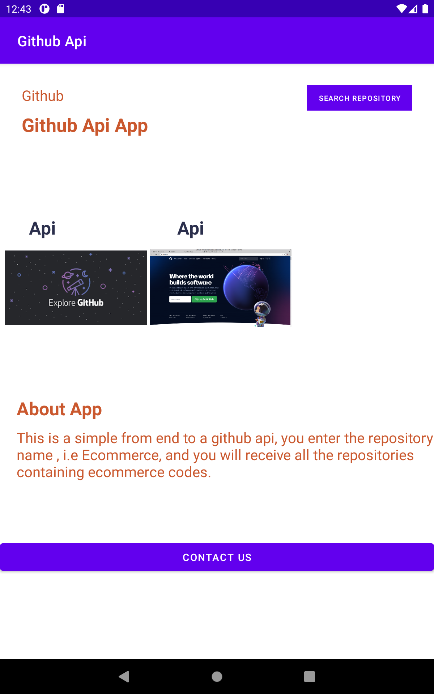
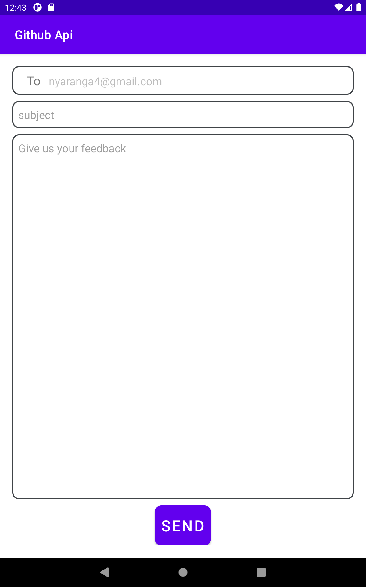
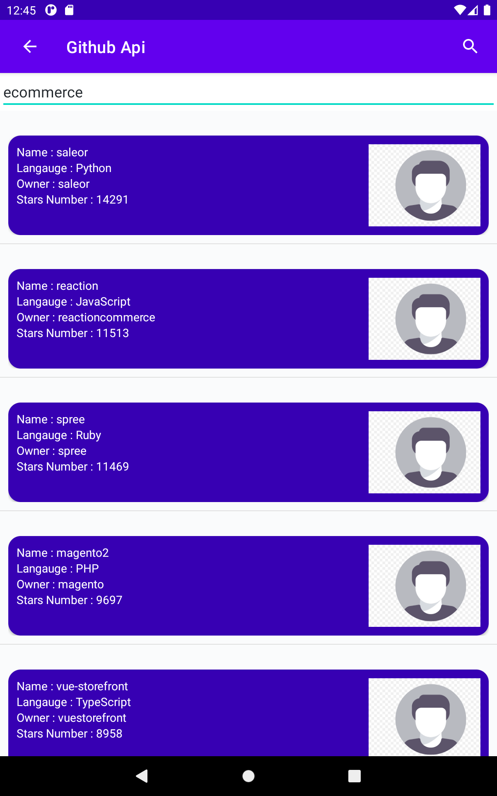

## GitHubApiApp

This is a project that consumes the github api endpoints and returns values as per the search query

## Screenshots

## Setup And Intallation
For users, just download the app on your Android device and you are good to go.a
For developers, clone the app from the following link https://github.com/JAPHETHNYARANGA/nyaranga-social-app-version2.git and open it in intellij or Android studio

## Technologies

* Android Os
* Java

# Contact
email the developer on nyaranga4@gmail.com.

## License
this project is under MIT license.